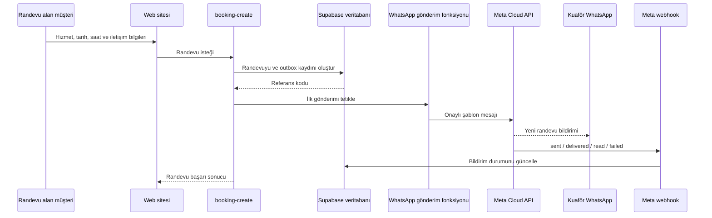

# Randevu Sonrası WhatsApp Bildirimi

Bu doküman, Line & İBA online randevu sisteminde yeni bir randevu alındığında kuaförün WhatsApp hattına otomatik bildirim gönderilmesi için gereken iş, hesap, erişim, güvenlik ve test adımlarını açıklar.

Son güncelleme: 23 Temmuz 2026

## 1. Kısa sonuç

WhatsApp bildirim kodu projede hazırdır. Yeni bir entegrasyon geliştirmek yerine aşağıdaki canlı ortam kurulumları tamamlanmalıdır:

1. Salon adına bir Meta Business Portfolio ve WhatsApp Business Account hazırlanması.
2. Bildirimleri gönderecek bir WhatsApp Cloud API numarasının tanımlanması.
3. Kuaförün bildirimi alacağı WhatsApp numarası veya numaralarının kesinleştirilmesi.
4. `new_appointment_owner_tr` isimli mesaj şablonunun Meta tarafında oluşturulması.
5. Kalıcı sistem kullanıcısı erişim anahtarının oluşturulması.
6. Meta webhook'unun Supabase fonksiyonuna bağlanması.
7. Gerekli değerlerin Supabase Function Secrets alanına eklenmesi.
8. Otomatik tekrar deneme görevinin Supabase Cron üzerinde açılması.
9. Gerçek bir uçtan uca randevu ile canlı test yapılması.

Mevcut sistemde randevu kaydı WhatsApp gönderimi başarısız olsa bile kaybolmaz. Bildirim ayrı bir outbox kaydında tutulur, en fazla 5 defa otomatik denenir ve yönetim panelinden manuel olarak tekrar gönderilebilir.

## 2. Kullanılacak yöntem

Önerilen ve mevcut kodun desteklediği yöntem **resmî Meta WhatsApp Cloud API**'dir.

WhatsApp Web otomasyonu, tarayıcı botu, kişisel WhatsApp oturumunu taklit eden paketler veya resmî olmayan servisler kullanılmamalıdır. Bunlar oturumun kapanması, numaranın kısıtlanması, güvenlik açığı ve sürdürülemeyen bakım riski oluşturur.

Meta'nın resmî Cloud API'si için temel varlıklar şunlardır:

- Meta Business Portfolio
- WhatsApp Business Account (WABA)
- Meta Business türünde uygulama
- Cloud API'ye bağlı gönderici telefon numarası
- `whatsapp_business_messaging` ve `whatsapp_business_management` yetkilerine sahip erişim anahtarı
- Onaylı/etkin bir mesaj şablonu
- HTTPS webhook adresi

Meta'nın resmî dokümantasyonuna göre Cloud API kullanmak için Business Portfolio, WABA ve işletme telefon numarası gerekir. Üretimde kısa ömürlü kullanıcı anahtarı yerine sistem kullanıcısı erişim anahtarı kullanılmalıdır.

## 3. Gönderen ve alan numaralar

Bu projede iki numaralı model kullanılmalıdır:

| Rol | Örnek | Açıklama |
|---|---|---|
| API gönderici numarası | `+90 5XX XXX XX XX` | Meta Cloud API'ye kaydedilir ve otomatik mesajı gönderir. |
| Bildirimi alan kuaför numarası | `+90 533 321 22 83` | Salon sahibi veya sorumlu personelin aktif WhatsApp hesabıdır. |

API gönderici numarası ile alıcı numarası aynı olmamalıdır. En temiz kurulum, yalnız otomasyon için ayrı ve salon adına kayıtlı bir mobil numara kullanmaktır. Bu numara kurulum sırasında SMS veya sesli arama ile doğrulanabilmelidir.

Salon mevcut WhatsApp Business numarasını API'ye taşımak veya aynı numarada uygulama/API birlikte kullanımı talep ederse bu, standart kurulumdan ayrı olarak değerlendirilmelidir. Numaranın mevcut durumu ve Meta hesabındaki uygunluk görülmeden taşıma yapılmamalıdır.

Mevcut veritabanı varsayılan alıcısı `905333212283` numarasıdır. Canlıya geçmeden önce müşteri bu numarayı yazılı olarak doğrulamalıdır. Birden fazla yöneticiye bildirim gönderilebilir.

## 4. Salon sahibinden/müşteriden istenecekler

Buradaki “müşteri”, web sitesini yaptığımız işletme/salon sahibidir.

### 4.1 Zorunlu işletme bilgileri

- İşletmenin resmî unvanı
- WhatsApp'ta görünecek marka adı: örneğin `Line & İBA`
- İşletme adresi
- İşletme web sitesi alan adı
- Kurumsal e-posta adresi
- Yetkili kişinin adı, soyadı ve işletmedeki rolü
- Yetkili kişinin telefon numarası
- Meta Business Portfolio ID; henüz yoksa birlikte oluşturulacağı bilgisi
- Meta tarafından işletme doğrulaması istenirse kullanılacak resmî şirket belgelerine erişebilecek yetkili kişi

Meta'nın talep edeceği doğrulama belgesi işletme ve ülke durumuna göre değişebilir. Vergi levhası, ticaret sicili veya adres/telefon doğrulama belgesi gibi evraklar ancak Meta ekranı açıkça talep ederse güvenli kanaldan alınmalıdır.

### 4.2 Meta hesabı ve erişim

Müşteriden şifre istenmemelidir. Şu iki yöntemden biri kullanılmalıdır:

1. Müşteri ekran paylaşımıyla kendi hesabında adımları tamamlar.
2. Müşteri geliştiriciyi Meta Business ayarlarından yetkili kişi/partner olarak davet eder.

Gerekli erişim kapsamı:

- Meta Business Portfolio erişimi
- Meta App erişimi
- WhatsApp Business Account erişimi
- WhatsApp telefon numarası yönetim yetkisi
- Mesaj şablonu yönetim yetkisi

Müşterinin kişisel Facebook/Meta şifresi, iki faktörlü doğrulama kodu veya kalıcı erişim anahtarı e-posta/WhatsApp üzerinden istenmemelidir.

### 4.3 Telefon numaraları

Müşteriden yazılı olarak şu iki bilgi alınmalıdır:

- **Gönderici numara:** Cloud API'ye bağlanacak ve SMS/sesli doğrulama alabilecek numara.
- **Alıcı numara veya numaralar:** Yeni randevu bildirimlerinin düşeceği aktif WhatsApp hesapları.

Her numara ülke koduyla istenmelidir:

```text
+905XXXXXXXXX
```

Veritabanında alıcı numarası `+` işareti olmadan tutulur:

```text
905XXXXXXXXX
```

Birden fazla alıcı örneği:

```sql
update public.booking_settings
set whatsapp_recipients = array[
  '905333212283',
  '905XXXXXXXXX'
]
where singleton = true;
```

### 4.4 Bildirim tercihleri

Müşteriden aşağıdaki kararlar alınmalıdır:

- Bildirim hangi numaralara gitsin?
- Bildirim her hizmet için gönderilsin mi?
- Online ve yönetim panelinden girilen manuel randevuların ikisi de bildirilsin mi? Mevcut sistem ikisini de gönderir.
- Müşteri notu WhatsApp mesajında görünsün mü? Mevcut sistem gösterir.
- Mesajda müşterinin telefon numarası görünsün mü? Mevcut sistem gösterir.
- Yönetim paneli bağlantısı mesajda yer alsın mı? Mevcut sistem gösterir.
- İptal, değişiklik ve yaklaşan randevu hatırlatması da isteniyor mu? Bunlar mevcut kapsamda yoktur ve ayrı özellik olarak planlanmalıdır.
- Bildirim yalnız işletme sahibine mi, yoksa vardiyadaki personele de mi gidecek?

### 4.5 Ödeme ve faturalandırma

- Meta Business hesabında geçerli ödeme yöntemi müşteri tarafından tanımlanmalıdır.
- WhatsApp Business Platform mesaj ücretleri müşteriye aittir.
- Ücretler ülke, mesaj kategorisi ve Meta'nın güncel fiyatlandırmasına göre değişebileceği için teklif içine sabit ve süresiz bir Meta mesaj fiyatı yazılmamalıdır.
- Teknik hizmet bedeli ile Meta kullanım bedeli ayrı kalemler olarak belirtilmelidir.

### 4.6 Yazılı onaylar

Müşteriden şu hususlar için yazılı onay alınmalıdır:

- Bildirim alıcı numaralarının işletmeye/yetkili personele ait olduğu
- Bu numaraların operasyonel WhatsApp bildirimi almayı kabul ettiği
- Mesajda ad-soyad, telefon, hizmet, tarih/saat ve isteğe bağlı notun yer alacağı
- Seçilen veri saklama süresi; sistemde varsayılan 12 ay
- KVKK aydınlatma metninin hukuk danışmanı tarafından kontrol edildiği veya kontrol sorumluluğunun işletmeye ait olduğu
- Meta ve diğer altyapı sağlayıcıları üzerinden veri işleme/aktarımının hukuken değerlendirildiği

## 5. Son kullanıcıdan randevu sırasında alınacak bilgiler

Web sitesinden randevu alan kişiden mevcut formda şu bilgiler alınır:

| Alan | Durum | Amaç |
|---|---|---|
| Hizmet | Zorunlu | Randevunun türünü belirlemek |
| Tarih | Zorunlu | Takvim kaydı |
| Saat | Zorunlu | Takvim kaydı |
| Ad soyad | Zorunlu | Randevuyu tanımlamak |
| Cep telefonu | Zorunlu | İletişim ve randevu yönetimi |
| Not | İsteğe bağlı | Saç/işlem talebi gibi ek bilgi |
| Dil | Otomatik | Arayüz ve kayıt dili |
| KVKK onayı | Zorunlu | Aydınlatma/işleme akışının kaydı |
| Turnstile tokenı | Sistemsel | Bot ve kötüye kullanım önleme |

Telefon doğrulaması Türkiye mobil numaralarına göre yapılır. Kabul edilen örnekler:

```text
0533 321 22 83
+90 533 321 22 83
5333212283
```

Sabit hat veya hatalı numara kabul edilmez.

### Müşteriye ayrıca WhatsApp onayı sormalı mıyız?

Mevcut kapsamda WhatsApp mesajı randevu alan kişiye değil, salonun kendi yetkili numarasına gönderilir. Bu nedenle müşteriye pazarlama amaçlı WhatsApp izin kutusu eklemek bu özelliğin çalışması için gerekli değildir.

İleride randevu alan kişiye WhatsApp teyidi, hatırlatma veya kampanya mesajı gönderilecekse ayrı bir izin ve ileti yönetimi tasarımı gerekir. Operasyonel randevu mesajları ile pazarlama mesajları aynı onay altında birleştirilmemelidir.

## 6. Gönderilecek mesaj şablonu

Mevcut kod şu şablonu bekler:

```text
Şablon adı: new_appointment_owner_tr
Dil: Türkçe (tr)
Önerilen kategori: Utility
```

Önerilen gövde:

```text
Yeni randevu alındı.

Referans: {{1}}
Tarih: {{2}}
Saat: {{3}}
Hizmet: {{4}}
Müşteri: {{5}}
Telefon: {{6}}
Not: {{7}}
Yönetim paneli: {{8}}
```

Değişkenlerin sırası kodla birebir aynı olmalıdır:

1. Randevu referans kodu
2. Tarih
3. Saat
4. Hizmet
5. Müşteri adı
6. Müşteri telefonu
7. Müşteri notu veya `-`
8. Yönetim paneli bağlantısı

Şablona reklam, kampanya veya satış metni eklenmemelidir. Meta şablonun kategorisi ve kullanılabilirliği konusunda son kararı verir.

Örnek canlı mesaj:

```text
Yeni randevu alındı.

Referans: LC-260723-A1B2C3
Tarih: 27 Temmuz 2026 Pazartesi
Saat: 14:00
Hizmet: Kesim & Stil
Müşteri: Ayşe Yılmaz
Telefon: +905XXXXXXXXX
Not: Katlı kesim istiyorum.
Yönetim paneli: https://site-adresi.com/yonetim/randevular
```

## 7. Mevcut teknik akış



İlgili proje parçaları:

- Randevu oluşturma: `supabase/functions/booking-create/index.ts`
- WhatsApp gönderimi: `supabase/functions/send-whatsapp-notifications/index.ts`
- Teslimat webhook'u: `supabase/functions/whatsapp-webhook/index.ts`
- Outbox ve alıcı ayarları: `supabase/migrations/20260720160000_create_booking_system.sql`
- En fazla 5 tekrar denemesi: `supabase/migrations/20260720183000_cap_notification_retries.sql`
- Yönetim ekranı ve manuel tekrar: `src/components/admin/AdminPage.tsx`

## 8. Meta tarafında kurulum sırası

### Adım 1 — Meta Business kontrolü

1. Müşteri Meta Business Suite'e kendi hesabıyla giriş yapar.
2. Doğru Business Portfolio seçilir veya yeni bir tane oluşturulur.
3. İşletme adı, adresi, web sitesi ve e-posta bilgileri tamamlanır.
4. Meta işletme doğrulaması talep ediyorsa müşteri kendi belgeleriyle tamamlar.
5. Geliştiriciye gerekli varlıklarda sınırlı erişim verilir.

### Adım 2 — Meta App ve WhatsApp ürünü

1. Meta Developers içinde Business türünde uygulama oluşturulur.
2. Uygulamaya WhatsApp ürünü eklenir.
3. Doğru Business Portfolio ve WABA bağlanır.
4. Test numarasıyla ilk deneme yapılır.
5. Uygulama kimliği ve App Secret güvenli parola yöneticisine kaydedilir.

### Adım 3 — Gönderici numara

1. Müşterinin otomasyon için belirlediği numara WhatsApp Manager'a eklenir.
2. SMS veya sesli aramayla numara sahipliği doğrulanır.
3. WhatsApp'ta görünecek işletme adı gönderilir ve durum takip edilir.
4. Cloud API kaydı sırasında altı haneli iki adımlı doğrulama PIN'i oluşturulur.
5. `Phone Number ID` kaydedilir. API isteğinde telefon numarasının kendisi değil bu kimlik kullanılır.

### Adım 4 — Mesaj şablonu

1. WhatsApp Manager > Message Templates bölümüne gidilir.
2. `new_appointment_owner_tr` şablonu oluşturulur.
3. Dil Türkçe seçilir.
4. Yukarıdaki sekiz değişken aynı sırayla eklenir.
5. Utility kategorisiyle gönderilir.
6. Şablon etkin olmadan canlı entegrasyon açılmaz.

### Adım 5 — Kalıcı erişim anahtarı

1. Business Settings > Users > System Users alanında bir sistem kullanıcısı oluşturulur.
2. Meta App ve WhatsApp hesabı bu kullanıcıya atanır.
3. En az şu izinlerle erişim anahtarı üretilir:
   - `whatsapp_business_messaging`
   - `whatsapp_business_management`
4. Anahtar yalnız Supabase secret olarak saklanır.
5. Geçici “Getting Started” tokenı üretimde kullanılmaz.

### Adım 6 — Webhook

Callback URL:

```text
https://<SUPABASE_PROJECT_REF>.supabase.co/functions/v1/whatsapp-webhook
```

Kurulum:

1. Uzun ve rastgele bir webhook verify token oluşturulur.
2. Aynı değer Meta webhook ayarına ve `META_WEBHOOK_VERIFY_TOKEN` secret'ına yazılır.
3. Meta App'in App Secret değeri `META_APP_SECRET` olarak eklenir.
4. `messages` webhook alanına abone olunur.
5. Uygulama ilgili WABA'ya subscribe edilir.
6. Meta'nın GET doğrulamasının başarılı olduğu görülür.
7. Bir test mesajıyla `sent`, `delivered`, `read` veya `failed` olayı kontrol edilir.

Webhook POST isteklerinin imzası mevcut kodda `x-hub-signature-256` ve App Secret ile doğrulanır.

## 9. Supabase canlı ortam ayarları

Gerekli Supabase Function Secrets:

| Secret | Kim sağlar? | Açıklama |
|---|---|---|
| `META_GRAPH_API_VERSION` | Geliştirici | Canlıya geçişte desteklenen Graph API sürümü |
| `META_WHATSAPP_ACCESS_TOKEN` | Meta sistem kullanıcısı | Sunucu tarafında saklanan erişim anahtarı |
| `META_WHATSAPP_PHONE_NUMBER_ID` | Meta | Cloud API gönderici numara kimliği |
| `META_WHATSAPP_TEMPLATE` | Geliştirici/Meta | `new_appointment_owner_tr` |
| `META_APP_SECRET` | Meta App | Webhook imza doğrulama anahtarı |
| `META_WEBHOOK_VERIFY_TOKEN` | Geliştirici | Rastgele oluşturulan webhook doğrulama değeri |
| `INTERNAL_FUNCTION_SECRET` | Geliştirici | Gönderim fonksiyonunu dış çağrılardan koruyan değer |
| `ADMIN_PANEL_URL` | Proje | Canlı yönetim paneli adresi |
| `ALLOWED_ORIGINS` | Proje | Canlı web sitesi origin'i |

Secret'lar şunlarda bulunmamalıdır:

- Git deposu
- Vite istemci ortam değişkenleri
- Tarayıcı JavaScript'i
- E-posta veya WhatsApp konuşması
- Ekran görüntüsü
- Dokümantasyon içine gerçek değer olarak

Örnek değer dosyası:

```dotenv
META_GRAPH_API_VERSION=vXX.X
META_WHATSAPP_ACCESS_TOKEN=<SYSTEM_USER_TOKEN>
META_WHATSAPP_PHONE_NUMBER_ID=<PHONE_NUMBER_ID>
META_WHATSAPP_TEMPLATE=new_appointment_owner_tr
META_APP_SECRET=<META_APP_SECRET>
META_WEBHOOK_VERIFY_TOKEN=<UZUN_RASTGELE_DEGER>
INTERNAL_FUNCTION_SECRET=<BASKA_UZUN_RASTGELE_DEGER>
ADMIN_PANEL_URL=https://site-adresi.com/yonetim/randevular
```

Canlı secret yükleme:

```bash
supabase secrets set --env-file supabase/functions/.env.production
```

`.env.production` Git'e eklenmemelidir.

## 10. Otomatik tekrar denemesi

İlk WhatsApp gönderimi randevu oluşturulduktan hemen sonra tetiklenir. İnternet, Meta veya geçici yapılandırma hatalarında bildirim outbox'ta kalır.

Supabase Cron üzerinde her 15 dakikada bir şu fonksiyona `POST` isteği gönderilmelidir:

```text
https://<SUPABASE_PROJECT_REF>.supabase.co/functions/v1/send-whatsapp-notifications
```

Header:

```text
x-internal-secret: <INTERNAL_FUNCTION_SECRET>
```

Davranış:

- Bir seferde en fazla 10 iş alınır.
- Kayıtlar eşzamanlı çalışan görevler tarafından iki kez alınmaz.
- Başarısız iş bir sonraki deneme zamanı gelince yeniden alınır.
- Otomatik deneme üst sınırı 5'tir.
- Beş denemeden sonra yönetim panelinde hata görünür.
- Yetkili kullanıcı “Tekrar Gönder” ile sayacı sıfırlayıp yeniden deneyebilir.
- Randevu iptal edilmişse gönderilmemiş outbox işi iptal edilir.

## 11. KVKK ve gizlilik kontrolü

WhatsApp bildiriminde şu kişisel veriler Meta altyapısından geçer:

- Ad soyad
- Cep telefonu
- Randevu hizmeti
- Tarih ve saat
- Serbest metin notu
- Randevu referansı

Mevcut KVKK sayfası bu verilerin randevuyu oluşturmak, salon takvimini yönetmek, müşteriyle iletişim kurmak ve işletmeye WhatsApp bildirimi göndermek amacıyla kullanılacağını belirtmektedir. Ancak canlıya geçmeden önce hukuk danışmanı en az şu noktaları kontrol etmelidir:

1. Veri sorumlusunun tam kimliği ve iletişim bilgileri
2. Her veri işleme amacı için doğru hukuki sebep
3. Verilerin aktarıldığı alıcı grupları
4. Supabase, Meta/WhatsApp ve barındırma sağlayıcılarının rolü
5. Yurt dışına veri aktarımı oluşup oluşmadığı ve uygulanacak güvence
6. 12 aylık saklama süresinin işletmenin gerçek ihtiyacıyla uyumu
7. Serbest not alanına sağlık veya başka özel nitelikli veri yazılması riski
8. Açık rıza ile aydınlatmanın birbirinden doğru şekilde ayrılması
9. İlgili kişi başvuru kanalı

KVKK Kurumu, aydınlatma metninde aktarım amacı ve alıcı gruplarının belirtilmesini ister. Yurt dışına veri aktarımı söz konusuysa güncel Kanun, yönetmelik ve uygun güvence mekanizması ayrıca değerlendirilmelidir. Bu doküman hukuki görüş yerine geçmez.

### Veri minimizasyonu önerisi

Kuaförün hızlı operasyonu için müşteri notunun tamamı WhatsApp'ta gerekli değilse mesajdan çıkarılması daha güvenli olur. Özellikle alerji, sağlık durumu veya benzeri hassas bilgiler serbest not alanına yazılabilir. Müşteri tercihine göre:

- Not alanı WhatsApp'tan tamamen çıkarılabilir.
- Not yerine yalnız “Not mevcut, panelden görüntüleyin” yazılabilir.
- Formda “Sağlık verisi veya hassas kişisel bilgi yazmayın” uyarısı gösterilebilir.

Bu değişiklik istenirse mesaj şablonu ve gönderim kodu birlikte güncellenmelidir.

## 12. Test planı

### 12.1 Meta test numarasıyla

1. Meta test alıcı listesine kuaförün numarası eklenir.
2. Meta'nın `hello_world` şablonu gönderilir.
3. Mesajın kuaför telefonuna geldiği görülür.
4. Bu test token, Phone Number ID ve alıcı formatının doğru olduğunu kanıtlar.

### 12.2 Proje şablonuyla

1. `new_appointment_owner_tr` şablonunun etkin olduğu kontrol edilir.
2. Supabase secret'ları yüklenir.
3. Gönderim fonksiyonu deploy edilir.
4. Fonksiyon geçerli internal secret ile manuel çağrılır.
5. Meta cevabındaki `wamid` outbox kaydına yazılmalıdır.

### 12.3 Uçtan uca randevu

1. Canlı siteden ileri tarihli müsait bir saat seçilir.
2. Test müşterisiyle randevu oluşturulur.
3. Web arayüzünde referans kodu görünür.
4. Veritabanında `appointments` kaydı oluşur.
5. `notification_outbox` kaydı `pending/processing` durumundan `sent` durumuna geçer.
6. Kuaför WhatsApp'ına doğru sekiz alanla mesaj gelir.
7. Yönetim panelinde randevu ve bildirim durumu görünür.
8. Mesajdaki yönetim paneli bağlantısı çalışır.

### 12.4 Hata ve kurtarma

Şu senaryolar ayrıca denenmelidir:

- Geçersiz token
- Yanlış Phone Number ID
- Yanlış şablon adı
- Şablon dili uyuşmazlığı
- Geçersiz alıcı numarası
- Webhook verify token uyuşmazlığı
- Webhook imzası geçersiz
- Cron header'ında yanlış internal secret
- Meta geçici servis hatası
- Başarısız bildirimden sonra panelde “Tekrar Gönder”
- Bildirim gönderilmeden randevu iptali

Test sırasında gerçek müşteri verisi kullanılmamalıdır.

## 13. Canlıya geçiş kabul kriterleri

Entegrasyon ancak aşağıdakilerin tamamı sağlandığında hazır kabul edilmelidir:

- [ ] Meta Business ve WABA işletmenin kontrolünde
- [ ] Gönderici numara doğrulanmış ve aktif
- [ ] Görünen işletme adı kabul edilmiş/uygun durumda
- [ ] Sistem kullanıcısı tokenı üretimde çalışıyor
- [ ] Gerekli iki WhatsApp yetkisi mevcut
- [ ] `new_appointment_owner_tr` şablonu etkin
- [ ] Sekiz değişken doğru sırada
- [ ] Alıcı numaraları müşteri tarafından yazılı doğrulanmış
- [ ] Supabase secret'ları yüklenmiş
- [ ] Webhook GET doğrulaması başarılı
- [ ] WABA webhook aboneliği yapılmış
- [ ] Mesaj status webhook'u veritabanını güncelliyor
- [ ] Cron görevi 15 dakikada bir çalışıyor
- [ ] Yönetim panelinde başarısız bildirim görünür
- [ ] Manuel tekrar gönderme çalışıyor
- [ ] KVKK metni işletme/hukuk danışmanı tarafından kontrol edilmiş
- [ ] Gerçek telefona en az bir uçtan uca test mesajı ulaşmış
- [ ] Token ve secret'ların Git geçmişinde olmadığı doğrulanmış

## 14. İşletmeye gönderilecek hazır bilgi talebi

Aşağıdaki metin müşteriye doğrudan gönderilebilir:

> Online randevu alındığında salon WhatsApp hattınıza otomatik bildirim gönderebilmemiz için aşağıdaki bilgileri rica ediyoruz:
>
> 1. İşletmenizin resmî unvanı, adresi, web sitesi ve kurumsal e-posta adresi  
> 2. WhatsApp'ta görünmesini istediğiniz işletme/marka adı  
> 3. Meta Business Portfolio hesabınızın olup olmadığı ve varsa Business ID  
> 4. WhatsApp Cloud API için kullanabileceğimiz, SMS veya sesli doğrulama alabilen gönderici telefon numarası  
> 5. Yeni randevu bildirimlerinin ulaşacağı WhatsApp numarası veya numaraları  
> 6. Bildirimde müşteri adı, telefonu, hizmeti, tarih/saati, notu ve yönetim paneli bağlantısının görünmesine onayınız  
> 7. Meta kullanım ücretleri için Business hesabınıza ödeme yöntemi ekleyebilecek yetkili kişi  
> 8. Meta işletme doğrulaması talep ederse gerekli şirket belgelerini kendi hesabınız üzerinden sunabilecek yetkili kişi  
> 9. KVKK aydınlatma metnini kontrol edecek işletme yetkilisi veya hukuk danışmanı  
>
> Güvenliğiniz için Facebook/Meta şifrenizi, iki faktörlü doğrulama kodunuzu veya erişim anahtarınızı mesajla istemeyeceğiz. Kurulumu ekran paylaşımıyla veya Meta Business üzerinden vereceğiniz sınırlı yetkiyle yapacağız.

## 15. Sorumluluk dağılımı

### Müşteri/salon sahibi

- Meta Business ve WhatsApp varlıklarının sahibi olmak
- İşletme bilgilerini doğru vermek
- Telefon numaralarını ve bildirim alıcılarını belirlemek
- SMS/sesli numara doğrulamasını yapmak
- Meta ödeme yöntemini tanımlamak
- Gerekirse işletme doğrulama belgelerini Meta'ya sunmak
- Bildirim içeriğini onaylamak
- KVKK/hukuki uygunluğu değerlendirmek

### Geliştirici

- Meta App ve Cloud API teknik bağlantısını kurmak
- En az yetki prensibiyle erişim istemek
- Secret'ları güvenli biçimde Supabase'e yüklemek
- Mesaj şablonunu kodla eşleştirmek
- Webhook, outbox, tekrar deneme ve yönetim panelini doğrulamak
- Test verisiyle uçtan uca testi yapmak
- Teknik hata kayıtlarını izlemek
- Müşteriye token veya şifre paylaşımı yaptırmamak

## 16. İleride eklenebilecek özellikler

Mevcut kapsam yalnız yeni randevuyu kuaföre bildirir. Aşağıdakiler ayrı geliştirme kalemidir:

- Müşteriye WhatsApp randevu teyidi
- Randevudan 24 saat/2 saat önce hatırlatma
- WhatsApp'tan onayla/iptal et butonları
- Randevu değişikliğini kuaföre bildirme
- İptal bildirimini kuaföre ve müşteriye gönderme
- Hizmet veya kuaför bazlı farklı alıcıya yönlendirme
- Vardiyaya göre dinamik alıcı seçimi
- `sent`, `delivered` ve `read` durumlarını yönetim panelinde ayrı gösterme
- Notu WhatsApp'a koymadan yalnız panelde gösterme
- Günlük randevu özeti

## 17. Resmî kaynaklar

- [Meta'nın resmî WhatsApp Business Platform çalışma alanı](https://www.postman.com/meta/whatsapp-business-platform/overview)
- [Meta Cloud API başlangıç ve erişim gereksinimleri](https://www.postman.com/meta/whatsapp-business-platform/documentation/wlk6lh4/whatsapp-cloud-api)
- [Meta Cloud API webhook açıklaması](https://www.postman.com/meta/whatsapp-business-platform/folder/lboq68h/webhooks)
- [Meta webhook durumları ve payload yapısı](https://www.postman.com/meta/whatsapp-business-platform/folder/tduohwq/webhook-payload-reference)
- [Meta WABA webhook abonelikleri](https://www.postman.com/meta/whatsapp-business-platform/folder/ozgs3jn/webhook-subscriptions)
- [KVKK aydınlatma yükümlülüğü tebliği](https://www.kvkk.gov.tr/Icerik/4132/aydinlatma-yukumlulugunun-yerine-getirilmesinde-uyulacak-usul-ve-esaslar-hakkinda-teblig)
- [KVKK yurt dışına veri aktarımı duyurusu ve standart sözleşmeler](https://www.kvkk.gov.tr/Icerik/7998/Standart-Sozlesme-Metinlerinin-Ingilizce-Cevirisine-Iliskin-Duyuru)

